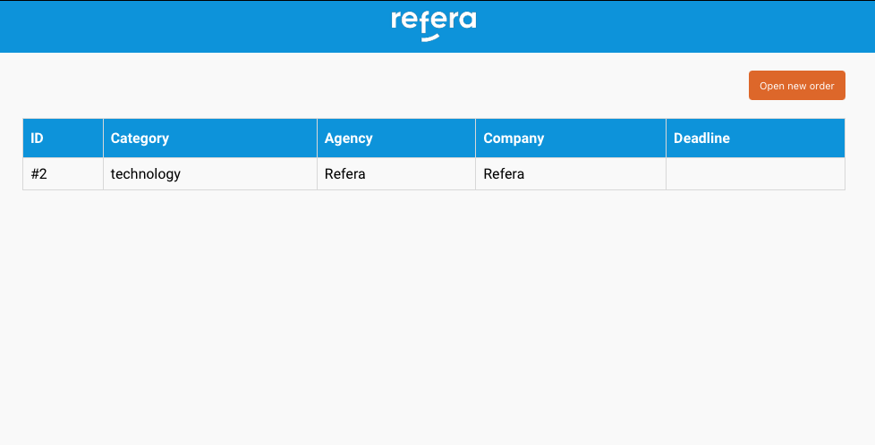
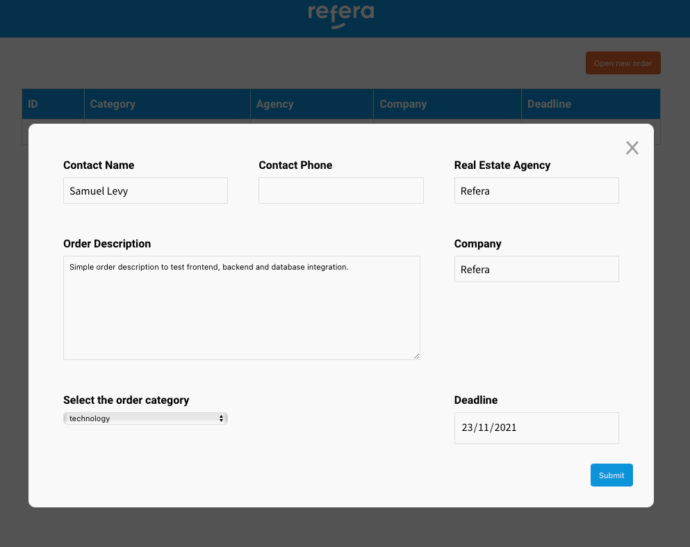
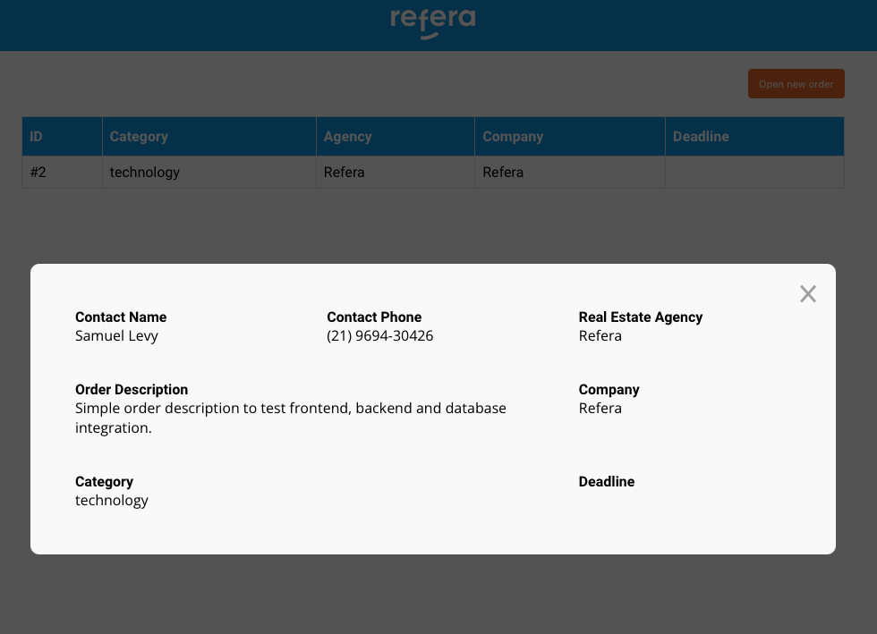

# Frontend Usage

## Description

Simple page application with `orders` data table, `order` detail modal page and `new order` screen to create new `orders`.

## Usage

Start project and open `http://localhost:3000/` in your webbrowser



Click `Open new order` to create a `order`



Click on `item` on `order list` to see more



## Installation

```bash
$ npm install
```

## Running

In the project directory, you can run:

- `npm run start`

Runs the app in the development mode.\
Open [http://localhost:3000](http://localhost:3000) to view it in the browser.

The page will reload if you make edits.\
You will also see any lint errors in the console.

- `npm run build`

Builds the app for production to the `build` folder.\
It correctly bundles React in production mode and optimizes the build for the best performance.

The build is minified and the filenames include the hashes.\
Your app is ready to be deployed!

See the section about [deployment](https://facebook.github.io/create-react-app/docs/deployment) for more information.
